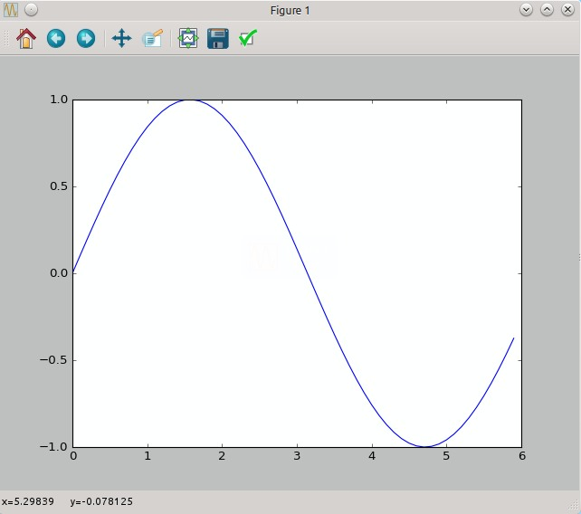

# Python 入門

## クラス

```python
class Hoge:
	def __init__(self, arg1, arg2):  # コンストラクタ
		# Initialize
	def method1(self, arg1):  # メソッド
		# Do anything
```

+ Pythonではメソッドの第一引数に自分自身を表す self を明示的に書くのが特徴。

## ライブラリのインポート

```python
import numpy as np
```

+ NumPy ライブラリを読み込んでいる。
+ 以降は np としてメソッドを参照できる。

## NumPy の算術演算

```python
import numpy as np
x = np.array([1.0, 2.0, 3.0])
y = np.array([2.0, 4.0, 6.0])

x + y  # array([ 3.,  6.,  9.])
x - y  # array([-1., -2., -3.])
x * y  # array([  2.,   8.,  18.])
x / y  # array([ 0.5,  0.5,  0.5])

# ブロードキャスト
x + z  # array([ 3.,  4.,  5.])
x - z  # array([-1.,  0.,  1.])
x * z  # array([ 2.,  4.,  6.])
x / z  # array([ 0.5,  1. ,  1.5])
```

+ 各要素ごとに四則演算を行っている。
+ 要素数が同じということに注意する。
+ 「要素ごと」という言葉は英語で element-wise という。
	+ 「要素ごとの積」 ... element-wise product
+ 単一の値(スカラ値)とも演算が可能で、これを「ブロードキャスト」という。


## 要素へのアクセス

インデックスによるアクセス

```python
X = np.array([[1, 2], [3, 4], [5, 6]])

X[0]     # array([1, 2])
X[0][1]  # 2

for row in X:
    print(row)
# [1 2]
# [3 4]
# [5 6]
```

配列によるアクセス

```python
# 一次元の配列に変換
X = X.flatten()  # array([1, 2, 3, 4, 5, 6])

# 0,2,4番目の要素を取得する
X[np.array([0, 2, 4])]  # array([1, 3, 5])
```

条件を指定して抜き出す

```python
# boolの配列に変換
X > 3     # array([False, False, False,  True,  True,  True], dtype=bool)

# Trueに対応する要素を抜き出す
X[X > 3]  # array([4, 5, 6])
```

## Matplotlib でグラフの描画

グラフを描画するためには matplotlib の pyplot というモジュールを利用する。

```python
import numpy as np
import matplotlib.pyplot as plot

# 0から6まで、0.1刻みで作成
x = np.arange(0, 6, 0.1)
y = np.sin(x)

plot.plot(x, y)
plot.show()
```


